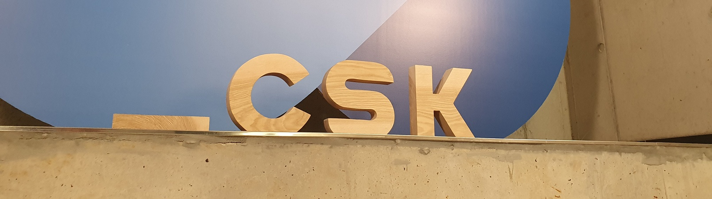

 

## Welcome to the SICK AppSpace Coding Starter Kit!

### What is it about?
The SICK AppSpace Coding Starter Kit (CSK) can be used as the basis for a modular approach to create [SICK AppSpace SensorApps](https://www.sick.com/sick-appspace).  

The official GitHub organization can be found [here](https://github.com/SICKAppSpaceCodingStarterKit).  

Looking forward to see you there!  

#### Further Information
This repository is just used to link to the official GitHub organization.  

All relevant data is available there.